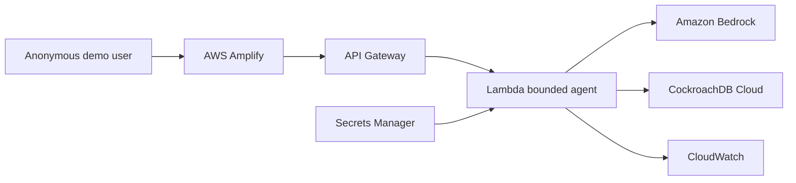

# NurManOS Agentic Memory

NurManOS Agentic Memory is an experimental public platform for persistent,
synthetic operational memory. In the **Aurora Demo Unit — Synthetic Workspace**,
Amazon Bedrock decides when to call a typed store or retrieve tool, Titan generates
1,024-dimensional embeddings, and CockroachDB performs durable namespace-isolated
vector recall.

It is a technical demonstration, not a medical device, clinical decision-support
system, or healthcare-production service. Use fictional data only.

## What the vertical slice proves

1. A user records an invented operational lesson.
2. Nova Micro autonomously selects the bounded `store_supervisor_memory` tool.
3. The runtime validates the tool input, rejects likely personal data, embeds the
   lesson with Titan V2, and transactionally upserts strict synthetic metadata.
4. In a new conversation, the user asks a semantic question.
5. Nova selects `retrieve_supervisor_memories`; CockroachDB applies a
   session-prefixed cosine vector index and Nova grounds its answer in returned keys.
6. The UI exposes sanitized operation, outcome, category, key, count, similarity,
   duration, and persistence evidence without revealing internal prompts or secrets.

## Architecture



The Lambda allows one tool operation and at most two model turns. Exact CORS,
strict schemas, runtime-owned UUID namespaces, parameterized SQL, TLS, timeouts,
throttling, reserved concurrency, least-privilege IAM, generic errors, seven-day
sanitized logs, and alarms keep the demo bounded. See
[Architecture](docs/ARCHITECTURE.md) and [Security](docs/SECURITY.md).

## Local development

Requirements: Node.js `22.14.0` and pnpm `10.15.0`.

```bash
pnpm install --frozen-lockfile
pnpm check
```

Copy `.env.example` to `.env.local` and provide only a public API origin:

```dotenv
VITE_API_BASE_URL=https://example.execute-api.eu-west-1.amazonaws.com
```

Then run `pnpm dev`. Development adds only the inline-style permission Vite needs;
the production CSP remains strict. No credential belongs in a `VITE_*` variable.

## Verification

```bash
pnpm check
pnpm audit --prod --audit-level high
pnpm security:scan
pnpm audit:public
git diff --check
```

The test suite covers strict contracts, extra-field rejection, personal-data
patterns, tool allowlisting and rounds, model stop transitions, runtime namespace
ownership, migrations, infrastructure boundaries, sanitized handlers, and the UI.
The public E2E probe is described in [Deployment](docs/DEPLOYMENT.md).

## Database and deployment

The schema is in `infra/sql`. New environments apply `001`, configured grants in
`002`, then strict synthetic hardening in `003`; upgrades must run the preflight in
[Release proof](docs/RELEASE_PROOF.md). AWS runtime infrastructure is declarative in
`infra/template.yaml`. See [Deployment](docs/DEPLOYMENT.md) and
[Operations runbook](docs/RUNBOOK.md) for reproducible steps and rollback.

## Safety and product status

Read the [synthetic data boundary](docs/DATA_BOUNDARY.md) before using the demo.
The [threat model](docs/THREAT_MODEL.md) documents anonymous-workspace, public-abuse,
and accidental-data risks. [Pilot readiness](docs/PILOT_READINESS.md) lists the
identity, DPIA, legal, clinical-governance, DPO, pentest, audit, retention, backup,
and validation gates required before any professional healthcare pilot.

H0 hackathon evidence is retained only as history in
[H0 runtime proof](docs/H0_RUNTIME_PROOF.md) and
[hackathon compliance](docs/HACKATHON_COMPLIANCE.md). It is not the product roadmap.

## Documentation

- [Architecture](docs/ARCHITECTURE.md)
- [Security](docs/SECURITY.md)
- [Threat model](docs/THREAT_MODEL.md)
- [Synthetic data boundary](docs/DATA_BOUNDARY.md)
- [Deployment](docs/DEPLOYMENT.md)
- [Runbook](docs/RUNBOOK.md)
- [Release proof](docs/RELEASE_PROOF.md)
- [Roadmap](docs/ROADMAP.md)
- [Pilot readiness](docs/PILOT_READINESS.md)

## License

[MIT](LICENSE)
