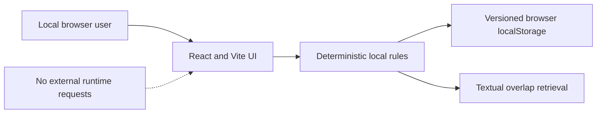

# NurManOS Agentic Memory

**NurManOS Agentic Memory v0.1.0 — Local Synthetic Demo** is a free,
browser-only demonstration of persistent operational memory. It stores fictional
lessons in this browser, retrieves them with deterministic textual matching, and
keeps them across reloads and new conversations.

> Modo demo local — los datos permanecen únicamente en este navegador. AWS y
> CockroachDB están desactivados.

It is a technical demonstration, not a medical device, clinical decision-support
system, healthcare-production service, or real AI deployment. Use fictional data
only.

## Available now

- A functional Spanish-first local application with English available.
- Synthetic examples and conservative likely-personal-data rejection.
- Versioned `localStorage` persistence scoped by anonymous workspace UUID.
- Idempotent upsert by memory key, deterministic textual retrieval, new
  conversations, and one-click restoration of the initial examples.
- A strict local CSP and no external request from `local-demo` runtime.
- AWS backend code, CloudFormation, and CockroachDB migrations retained for future
  explicitly authorized use.
- Public CI and H0 hackathon material retained as historical evidence.

## Not deployed now

- H1 Lambda, API Gateway, Amplify, or public backend.
- Production Bedrock execution or embedding generation.
- H1 CockroachDB runtime access.
- Public end-to-end deployment.

This is a deliberate cost-avoidance decision, not an abandoned implementation.
The AWS adapter is never selected automatically and local startup does not depend
on AWS, Bedrock, or CockroachDB.

## Run locally on Windows PowerShell

Requirements: Node.js `22.14.0` and pnpm `10.15.0`.

```powershell
Set-Location "C:\Users\luism\source\repos\nurmanos-agentic-memory"
corepack enable
pnpm install --frozen-lockfile
if (-not (Test-Path -LiteralPath ".env.local")) {
  Copy-Item .env.local.example .env.local
}
pnpm dev:local
```

Open `http://127.0.0.1:5173`. If Vite reports another port because 5173 is busy,
open the exact URL it prints.

To stop the server:

```text
Ctrl+C
```

`.env.local` remains ignored by Git. If it already exists, do not print it or
overwrite it; ensure only that `VITE_APP_MODE=local-demo` is configured. Never put
credentials, hosts, passwords, certificates, or account identifiers in a `VITE_*`
variable.

## Try the complete local journey

1. Select **Recordar una lección de hidratación** and send it.
2. Reload the browser or select **Nueva conversación**.
3. Select **Preguntar por hidratación** and send it.
4. Inspect the grounded memory key and sanitized local activity receipt.
5. Select **Restaurar ejemplos** to remove custom memories only from the current
   local workspace and restore its original synthetic examples.

The similarity percentage is deterministic textual overlap. It is not an
embedding or vector-search result.

## Architecture



The local and AWS adapters share the validated request/response contract but are
implemented separately. Future AWS mode requires the explicit `aws` setting and a
public API origin. It is documented for later review; it is not the current
release runtime. See [Architecture](docs/ARCHITECTURE.md) and
[Deployment hold](docs/DEPLOYMENT.md).

## Verification

```powershell
pnpm format:check
pnpm lint
pnpm typecheck
pnpm test
pnpm build
pnpm audit --prod --audit-level high
pnpm security:scan
pnpm audit:public
git diff --check
```

The suite covers strict backend contracts as well as local no-network execution,
persistence, reload, conversation continuity, idempotent upsert, workspace
isolation, reset, disclosure, CSP, and sanitized evidence. The Lambda bundle is
built but never deployed.

## Safety and historical status

Read the [synthetic data boundary](docs/DATA_BOUNDARY.md) before using the demo.
The [threat model](docs/THREAT_MODEL.md) and
[pilot readiness](docs/PILOT_READINESS.md) make clear that no professional
healthcare use is authorized.

H0 and the former hackathon documentation are preserved solely as historical
evidence in [H0 runtime proof](docs/H0_RUNTIME_PROOF.md) and
[hackathon compliance](docs/HACKATHON_COMPLIANCE.md). They do not describe the
current local runtime or a production roadmap.

## Documentation

- [Architecture](docs/ARCHITECTURE.md)
- [Security](docs/SECURITY.md)
- [Threat model](docs/THREAT_MODEL.md)
- [Synthetic data boundary](docs/DATA_BOUNDARY.md)
- [Deployment hold](docs/DEPLOYMENT.md)
- [Operations runbook](docs/RUNBOOK.md)
- [Release proof](docs/RELEASE_PROOF.md)
- [Roadmap](docs/ROADMAP.md)
- [Pilot readiness](docs/PILOT_READINESS.md)

## License

[MIT](LICENSE)
