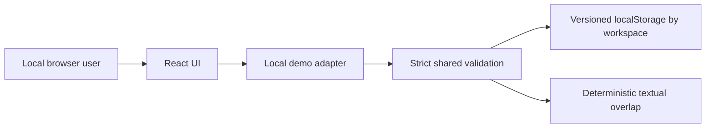
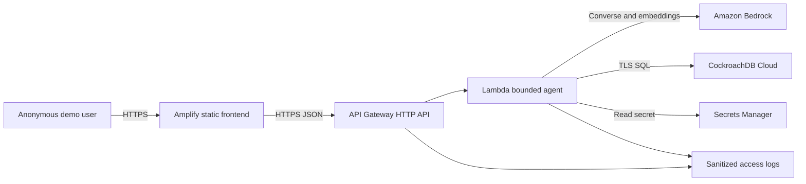
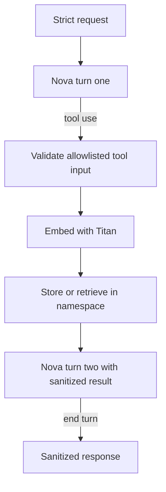

# Architecture

NurManOS Agentic Memory v0.1.0 runs as a browser-only local synthetic demo. It is
not an internet-facing deployment or a clinical system.

## Current local runtime

The local adapter does not initialize the AWS adapter and does not call `fetch`.
Memories are validated when loaded because browser storage is untrusted. Stable
keys provide idempotent updates; opaque workspace UUIDs prevent accidental mixing.
Reset replaces only the selected local workspace with the curated synthetic seeds.

## Prepared future AWS architecture

The following architecture remains in source but is not deployed in v0.1.0:

## Future AWS runtime flow

1. The browser creates an opaque UUID workspace and retains it in local storage.
2. API Gateway accepts only `GET /api/health` and `POST /api/agent`, applies an
   exact CORS origin, throttling, and a 29-second integration timeout.
3. Lambda validates the strict request schema, payload size, synthetic-data
   confirmation, likely-personal-data patterns, and the exact request origin.
4. Nova Micro may select one allowlisted tool. The model never supplies or
   changes the session namespace; the runtime attaches it after validation.
5. Titan Text Embeddings V2 produces a normalized 1,024-dimensional embedding.
6. The database adapter performs a parameterized transactional upsert or a
   session-prefixed cosine search. Serializable retries are bounded.
7. Nova receives the sanitized tool result and must finish with `end_turn`.
8. The API returns a concise answer, opaque request ID, memory keys, approximate
   duration, and sanitized activity events. Full prompts, vectors, SQL, hosts,
   credentials, account IDs, and chain-of-thought are never returned.

## Bounded agent loop

The loop permits at most two model turns and one tool operation. Per-call aborts,
a 24-second agent deadline, a 28-second Lambda timeout, payload/output bounds,
reserved concurrency of two, and API throttling constrain availability and cost.

## Data model

`h1_supervisor_memories` contains a UUID primary key, UUID `session_id`, stable
`memory_key`, bounded synthetic `content`, enum-like `category`, `VECTOR(1024)`
embedding, JSONB metadata, and timestamps. `(session_id, memory_key)` is unique;
the cosine vector index begins with `session_id` to preserve namespace isolation.
Metadata must contain the JSON boolean `"synthetic": true`.

## Build and delivery

Vite currently emits a `local-demo` frontend and esbuild still verifies one Node.js
22 Lambda file with no source map. CloudFormation is source-only. GitHub Actions
runs deterministic validation but has no cloud credentials and cannot deploy.
Future AWS activation must be explicit, separately approved, and cost-reviewed.
