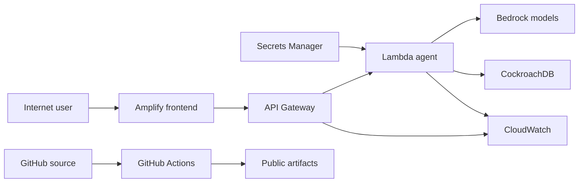

# NurManOS Agentic Memory threat model

## Executive summary

The dominant risks are abuse of an anonymous internet API, synthetic-workspace
disclosure through a stolen UUID, prompt-driven misuse of the bounded tool loop,
and accidental submission of real-world data. Current controls make the impact
acceptable for a synthetic public demo, but absence of identity, per-user policy,
and institutional governance makes the system unsuitable for a healthcare pilot.

## Scope and assumptions

In scope: `src/frontend`, `src/lambda`, `src/shared`, `infra`, public build output,
and `.github/workflows/ci.yml`. Runtime, build/CI, and tests are distinguished.
Private repositories, clinical documents, AWS/Cockroach control planes, Bedrock
model internals, and endpoint compromise outside this stack are out of scope.

The mission specification confirms these assumptions: internet-exposed public
technical demo; fictional synthetic data only; anonymous UUID namespaces; no
authentication or authorization; low demo volume; AWS `eu-west-1`; no clinical
decision support; and a future regulated pilot is a separate phase. These explicit
inputs serve as the requested context validation. A change in data sensitivity,
multi-tenancy promises, traffic, or identity requirements materially changes risk.

Open questions before any pilot: who is the accountable service owner and DPO;
which jurisdictions and retention rules apply; and which SSO/RBAC and tenant model
will be approved?

## System model

### Primary components

The React/Vite browser app submits strict JSON to API Gateway. A Node.js 22 Lambda
runs a two-turn Bedrock agent, invokes Titan embeddings, and accesses CockroachDB
using a Secrets Manager credential. CloudWatch receives sanitized logs. CI builds
and scans without deployment credentials. Evidence: `src/frontend/App.tsx`,
`src/lambda/handler.ts`, `src/lambda/agent.ts`, `infra/template.yaml`.

### Data flows and trust boundaries

- Internet → Amplify: static HTML/JS over HTTPS; CSP and security headers constrain
  browser behavior; all browser state is untrusted.
- Browser → API Gateway: message, UUID namespace, and synthetic confirmation over
  HTTPS JSON; exact CORS, payload limits, throttling, and strict schema validation.
- API Gateway → Lambda: AWS proxy event; only health and agent routes are accepted;
  origin and body are revalidated by `handler`.
- Lambda → Bedrock: bounded prompt/tool schema over AWS API; IAM restricts models,
  per-call aborts apply, and tool input is parsed again.
- Lambda → CockroachDB: synthetic content, embedding, and namespace over TLS; SQL is
  parameterized, statements time out, and namespace is mandatory.
- Lambda/API → CloudWatch: opaque IDs and bounded telemetry only; no input bodies,
  content, vectors, or credentials.
- GitHub → build artifacts: developer-controlled source becomes public static and
  Lambda bundles; CI has read-only repository permissions and no cloud secret.

#### Diagram

## Assets and security objectives

| Asset                          | Why it matters                            | Security objective (C/I/A) |
| ------------------------------ | ----------------------------------------- | -------------------------- |
| Database credential and CA     | Grants durable memory access              | C/I                        |
| Synthetic memory and namespace | Demonstrates correct isolation and recall | C/I/A                      |
| Bedrock invocation permission  | Controls model access and cost            | I/A                        |
| Lambda/API availability        | Required for the public journey           | A                          |
| Tool and validation policy     | Prevents model-directed boundary bypass   | I                          |
| Sanitized logs and evidence    | Supports operations without leakage       | C/I                        |
| Source and release artifacts   | Public supply-chain trust                 | I                          |

## Attacker model

### Capabilities

An unauthenticated remote attacker can load the frontend, construct direct API
requests, choose all request fields, repeat requests within limits, attempt prompt
injection, guess or steal a workspace UUID, and inspect public source and bundles.

### Non-capabilities

The model assumes no AWS, GitHub, CockroachDB, or operator credential; no ability
to break TLS or AWS isolation; no access to private NurManOS repositories; and no
real healthcare data in the service. Developer or cloud-account compromise is a
separate control-plane incident.

## Entry points and attack surfaces

| Surface               | How reached        | Trust boundary           | Notes                                   | Evidence (repo path / symbol)    |
| --------------------- | ------------------ | ------------------------ | --------------------------------------- | -------------------------------- |
| `POST /api/agent`     | Public HTTPS       | Internet → API           | Strict JSON and origin gate             | `src/lambda/handler.ts: handler` |
| `GET /api/health`     | Public HTTPS       | Internet → API           | Secret-free fixed response              | `src/lambda/handler.ts: handler` |
| Agent tool input      | Bedrock tool use   | Model → runtime          | Strict allowlist; server adds namespace | `src/lambda/agent.ts: runAgent`  |
| Store/retrieve SQL    | Lambda adapter     | Runtime → database       | Parameterized and bounded               | `src/lambda/database.ts`         |
| Browser storage       | Local browser      | Browser → API            | UUID is a bearer namespace              | `src/frontend/App.tsx`           |
| Runtime configuration | Environment/secret | Control plane → Lambda   | One secret ARN and public model IDs     | `infra/template.yaml`            |
| CI/build              | Public Git push/PR | Source → runner/artifact | Read-only permissions and scans         | `.github/workflows/ci.yml`       |

## Top abuse paths

1. Cost exhaustion: attacker automates valid requests → API invokes models → quota
   and cost rise → legitimate demo traffic is throttled.
2. Namespace takeover: attacker obtains a UUID from shared browser state or a link
   leak → submits direct requests → reads or overwrites synthetic workspace memory.
3. Tool-policy injection: attacker asks the model to ignore tool rules → model emits
   unexpected fields or content → runtime rejects the strict schema or PII pattern.
4. Real-data submission: user ignores the banner → enters an identifier not caught
   by regex → content is embedded and persisted → policy breach despite no clinical use.
5. Large/slow workload: attacker sends maximum valid input repeatedly → Bedrock or DB
   latency accumulates → agent deadline fails and capacity is occupied.
6. Error probing: attacker triggers provider/database faults → examines public errors
   and logs → sanitized responses prevent infrastructure-detail disclosure.
7. Supply-chain tampering: compromised contributor changes dependency or workflow →
   CI builds malicious output → review, lockfile, scans, and protected publication are
   required to stop a tainted release.

## Threat model table

| Threat ID | Threat source                     | Prerequisites                    | Threat action                                         | Impact                                        | Impacted assets            | Existing controls (evidence)                                                                         | Gaps                                                | Recommended mitigations                                       | Detection ideas                                        | Likelihood | Impact severity | Priority |
| --------- | --------------------------------- | -------------------------------- | ----------------------------------------------------- | --------------------------------------------- | -------------------------- | ---------------------------------------------------------------------------------------------------- | --------------------------------------------------- | ------------------------------------------------------------- | ------------------------------------------------------ | ---------- | --------------- | -------- |
| TM-001    | Remote attacker                   | Public endpoint                  | Automate model requests to exhaust quota/capacity     | Demo outage or unexpected cost                | API, Bedrock permission    | Throttling and reserved concurrency (`infra/template.yaml`)                                          | No per-client quota or WAF                          | Add usage plans/auth and cost anomaly alerts before scale     | Throttle, invocation, duration, and 5xx alarms         | high       | medium          | high     |
| TM-002    | UUID holder                       | Workspace UUID is exposed        | Read or overwrite another synthetic namespace         | Synthetic-data confidentiality/integrity loss | Memory                     | UUID namespace and parameterized filters (`src/lambda/database.ts`)                                  | UUID is not authorization                           | Add SSO, signed server sessions, tenant authorization         | Flag namespace access anomalies without logging UUIDs  | medium     | medium          | medium   |
| TM-003    | Prompt attacker                   | Valid request                    | Manipulate model toward forbidden tool fields/content | Policy bypass attempt or corrupt memory       | Tool policy, memory        | Tool allowlist, strict schemas, runtime namespace (`src/lambda/agent.ts`, `src/shared/contracts.ts`) | Model output is probabilistic                       | Preserve runtime authority; add adversarial regression corpus | Count validation failures and unsupported stop reasons | high       | low             | medium   |
| TM-004    | Well-meaning user                 | Pattern misses sensitive input   | Submit real-world data despite policy                 | Privacy and governance breach                 | Stored content, embeddings | Confirmation and two-boundary PII checks (`src/shared/privacy.ts`)                                   | Regex is not DLP                                    | Do not permit real use; add DLP and governance for pilot      | Monitor rejection rate, never raw content              | medium     | high            | high     |
| TM-005    | Remote attacker                   | Repeated maximum valid requests  | Occupy Lambda/DB/model time                           | Partial denial of service                     | Availability, cost         | Body/result/round limits and aborts (`src/shared/contracts.ts`, `src/lambda/bedrock.ts`)             | Abort does not cancel every downstream operation    | Add authenticated quotas and WAF; load test                   | p95 duration, concurrency, DB statement failures       | medium     | medium          | medium   |
| TM-006    | Dependency/contributor compromise | Malicious source reaches release | Inject browser exfiltration or runtime backdoor       | Credential or integrity compromise            | Artifacts, secrets         | Lockfile, read-only CI, CSP, scans (`.github/workflows/ci.yml`, `index.html`)                        | No signed provenance or mandatory review documented | Protect main, require CI/review, add provenance/SBOM          | Dependabot alerts and release diff review              | low        | high            | medium   |
| TM-007    | Runtime fault/prober              | Provider or DB error             | Extract secret or host details from errors/logs       | Infrastructure disclosure                     | Credentials, topology      | Generic errors and sanitized logs (`src/lambda/handler.ts`)                                          | Cloud console viewers remain privileged             | Least-privilege log access and periodic log audit             | Alert on runtime-error bursts                          | low        | high            | medium   |

## Criticality calibration

- Critical: credible public path to AWS/database credential theft, remote code
  execution in Lambda, or access to real regulated data. Examples: exposed database
  secret, deployment backdoor, cross-tenant real-patient export.
- High: likely cost/availability abuse or real-data persistence with meaningful harm.
  Examples: unbounded model invocation, accepted clinical content, auth bypass in a pilot.
- Medium: synthetic namespace takeover, bounded denial of service, or a supply-chain
  condition needing additional compromise.
- Low: sanitized metadata disclosure, rejected prompt injection, or brief noisy
  degradation with no durable data or cost effect.

## Focus paths for security review

| Path                       | Why it matters                                   | Related Threat IDs             |
| -------------------------- | ------------------------------------------------ | ------------------------------ |
| `src/lambda/handler.ts`    | Public parsing, origin, time, and error boundary | TM-001, TM-004, TM-005, TM-007 |
| `src/lambda/agent.ts`      | Tool authority and model-transition enforcement  | TM-003, TM-004                 |
| `src/lambda/database.ts`   | Namespace, SQL, TLS, retry, and similarity logic | TM-002, TM-005, TM-007         |
| `src/lambda/bedrock.ts`    | Model IAM assumptions, prompts, and aborts       | TM-001, TM-003, TM-005         |
| `src/shared/contracts.ts`  | All externally and model-controlled schemas      | TM-003, TM-004, TM-005         |
| `src/shared/privacy.ts`    | Fallible sensitive-input rejection               | TM-004                         |
| `src/frontend/App.tsx`     | Bearer workspace storage and public evidence     | TM-002, TM-004                 |
| `infra/template.yaml`      | IAM, CORS, throttling, logs, and alarms          | TM-001, TM-005, TM-007         |
| `.github/workflows/ci.yml` | Public supply-chain gate                         | TM-006                         |

Quality check: both HTTP entry points, every runtime and build trust boundary, and
runtime-versus-CI separation are covered. The user-supplied mission validated the
deployment, exposure, data, and auth assumptions. Pilot ownership and regulatory
context remain intentionally open.
